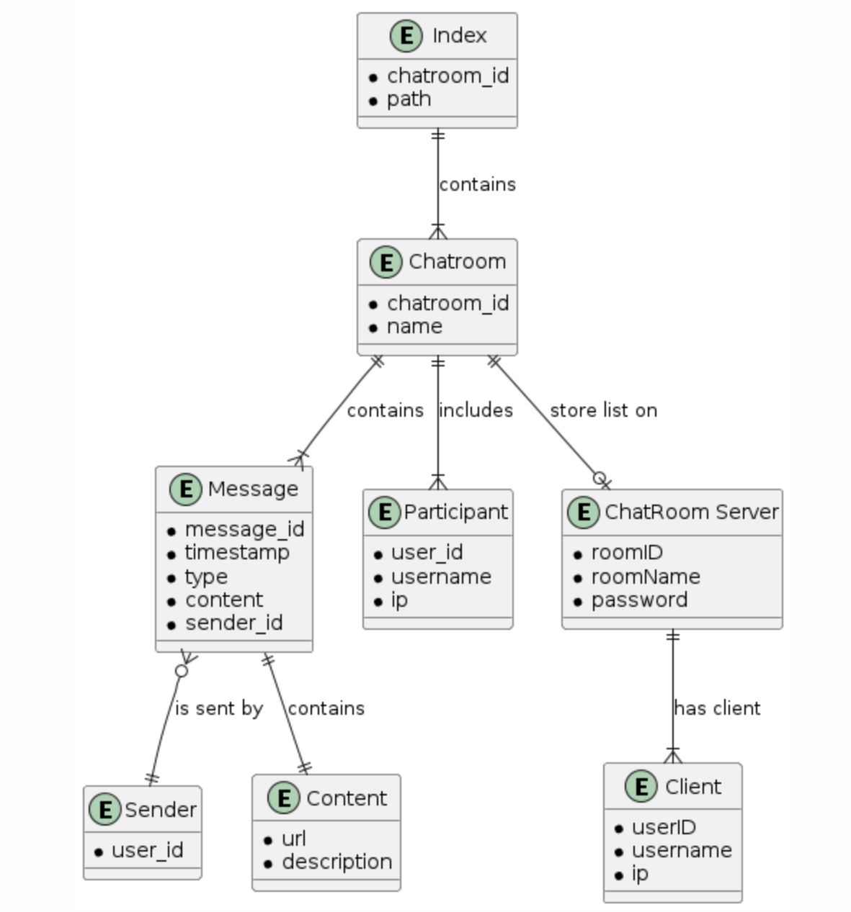

# 网络聊天室数据储存设计

**项目名称**：网络聊天室

**摘要**  ：本文档主要介绍团队计划开发的小型数据管理软件，系统阐述在开发过程中的具体需求，以及设计约束条件，作为将来项目设计、测试和验收的标准。

**相关文档**： 

**版权所有**：（除特别允许否则只在项目组内部使用）

**修改记录：**

| **日期** | **版本** | **说明**         | **作者** |
| -------- | -------- | ---------------- | -------- |
| 2024/5/4 | V1.0     | 数据储存设计草稿 | Yu       |
|          |          |                  |          |
|          |          |                  |          |
|          |          |                  |          |
|          |          |                  |          |

## 1 简介

这是一个基于局域网的聊天室客户端，用于连接同一个局域网内的独立IP用户，通过创建聊天室进行信息的交互，包括文本，图像，视频。

本文档对项目中的数据储存方式进行规范。


### 1.1目的

本文档的目的是详细阐述网络聊天室项目的数据存储设计需求，包括但不限于数据结构、存储格式。此外，本文档将作为开发团队在项目设计、实施、测试和验收过程中的参考标准。


### 1.2范围

本文档的范围涵盖以下几个关键方面：数据储存设计，数据储存结构，数据物理储存。


## 2 数据储存设计

### 2.1概念模型


但是在实际应用上，由于本机用户的ip唯一，不需要得知他人ip，不需要保存全部聊天室信息，所以只需将文本记录以json文件写入用户本地，并将图片音频视频文件写入本地即可。


### 2.2逻辑模型




### 物理模型

#### Client

```json
eg: index.json
{
  "chatrooms": [
  {
    "chatroom_id": "chatroom-1234",
    "path": "~/.cache/chatroom-1234.json"

  },{
    "chatroom_id": "chatroom-foo",
    "path": "~/.cache/chatroom-foo.json"
  }
  ]
}
eg: chatroom-1234.json
{
  "chatroom": {
    "name": "Global Chatroom",
    "messages": [
      {
        "message_id": 0,
        "timestamp": "2024-05-09T10:30:00Z",
        "sender": {
          "user_id": "user-1001",
        },
        "type": "text",
        "content": "Hello everyone!"
      },
      {
        "message_id": 1,
        "timestamp": "2024-05-09T10:35:00Z",
        "sender": {
          "user_id": "user-1003",
        },
        "type": "video",
        "content": {
          "url": "https://example.com/video123.mp4",
          "description": "A short video clip"
        }
      },
      {
        "message_id": 2,
        "timestamp": "2024-05-09T10:40:00Z",
        "sender": {
          "user_id": "user-1004",
        },
        "type": "audio",
        "content": {
          "url": "file:///home/.foo/bar.flac",
          "description": "An local store file"
        }
      }
    ]
  }
}
```

多媒体文件通过 url 表示, 可以为本地路径

```json
eg: chatroom-1234-members.json
{
    "participants": [
      {
        "user_id": "user-1001",
        "username": "Alice",
        "ip": "192.168.1.10"
      },
      {
        "user_id": "user-1002",
        "username": "Bob",
        "ip": "192.168.1.11"
      },
      {
        "user_id": "user-1003",
        "username": "Charlie",
        "ip": "192.168.1.12"
      },
      {
        "user_id": "user-1004",
        "username": "David",
        "ip": "192.168.1.13"
      }
    ]
}
```

#### Server

server 端数据结构由于不需要持久化存储，固直接给出 C++ 类定义

```cpp
struct Client{
  size_t userID;
  std::string username;
  std::string ip;
  std::list<std::string> joinedRooms;
};

struct ChatRoom{
  size_t romeID;
  std::string roomName;
  std::string password;
  std::list<std::shared_ptr<Client>> users;
  std::list<std::string> blacklist;
};

std::unordered_map<size_t, std::shared_ptr<Client>> clients; // 维护在线客户端
std::unordered_map<std::string, ChatRoom> chatrooms; // 维护在线房间
```


## 3 数据储存结构

### 4.1聊天室列表

#### 信息说明：

**文件格式**：JSON (JavaScript Object Notation)

**存储内容**：聊天室id，聊天室记录文件路径


### 4.2聊天室记录文件

**文件格式**：JSON (JavaScript Object Notation)

**存储内容**：

- `name`: 聊天室的名称。
- `messages`: 这是一个数组，包含了聊天室内所有消息的对象。


### 4.3聊天成员文件

**文件格式**：JSON (JavaScript Object Notation)

**存储内容**：聊天记录的序列化表示，包括但不限于以下字段：

- `name`: 聊天室的名称。
- `participants` 是一个数组，列出了所有参与特定聊天室的用户。


## 4 数据物理储存

数据将以如下形式储存于用户本地

### 4.1聊天记录文件

- **文件命名约定**：`chatroomName.json`
  
  - `chatroomName`：聊天记录属于的聊天室。
  
- **文件格式**：JSON (JavaScript Object Notation)

- **存储内容**：聊天记录的序列化表示，包括但不限于以下字段：
  
  - `name`: 聊天室的名称。
  
  - `messages`: 这是一个数组，包含了聊天室内所有消息的对象。
  
    - 每个消息对象都包含了以下字段：
  
      - `"message_id"`: 消息的唯一标识符，用于区分聊天室内的不同消息。
      - `"timestamp"`: 消息发送时的时间戳.
      - `sender`: 发送消息的用户信息，其中包含：
        - `user_id`: 发送者的用户唯一标识符。
      - `type`: 消息的类型，可以是`text`、`video`或`audio`等。
  
      - `content`: 消息的内容，具体结构取决于消息类型：
  
        - 对于文本消息，它直接包含文本字符串。
  
        - 对于视频或音频消息，它包含一个对象，该对象可能包含：
  
          - `url`: 媒体文件的链接，可以是网络 URL（如 `https://example.com/video123.mp4"`）或本地文件路径（如`file:///home/.foo/bar.flac`）。
  
          - `description`: 对媒体内容的简短描述，如 `A short video clip` 或 `An local store file`。
  
            

### 4.2聊天室成员文件

- **文件命名约定**：`chatroomName.json`
  - `chatroomName`：聊天记录属于的聊天室。
- **文件格式**：JSON (JavaScript Object Notation)
- **存储内容**：聊天记录的序列化表示，包括但不限于以下字段：
  - `name`: 聊天室的名称。
  - `participants` 是一个数组，列出了所有参与特定聊天室的用户。
  - 每个参与者都是一个对象，包含了以下字段：
    - 每个消息对象都包含了以下字段：
    - `user_id`: 用户的唯一标识符。`
    - `username`: 用户的名称或昵称。
    - `ip`: 用户的 IP 地址，这可能用于标识用户的网络位置，尤其是在聊天室环境中。


